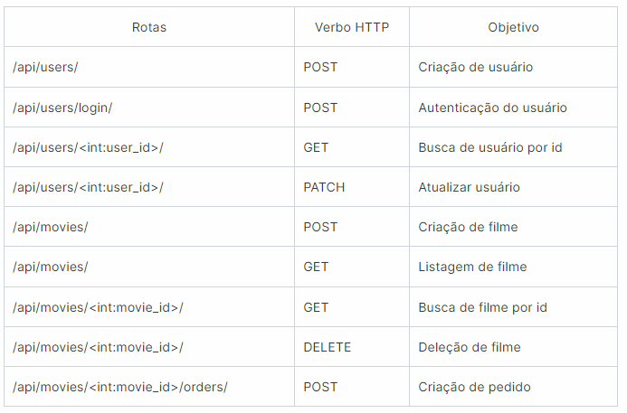

# Block Buster

O projeto se trata de uma API para o gerenciamento de uma locadora de filmes, aonde é possível registrar funcionários e clientes, para compras e vendas de filmes.

### Funcionalidades

- Customização do usuário com base no `AbstractUser`;
- Serializers e Validação customizada;
- Proteção de rotas via autenticação JWT e permissão customizada do Django Rest Framework;
- Relacionamentos 1:1 e N:N;
- Tabela Pivô customizada;
- Paginação com APIView;

### Tecnologias utilizadas:

- Python;
- Django;
- Django rest framework;
- DjangoORM;
- Djangorestframework-simplejwt;
- pytest;
- sqlite3;

### **Rotas**  

 

  

